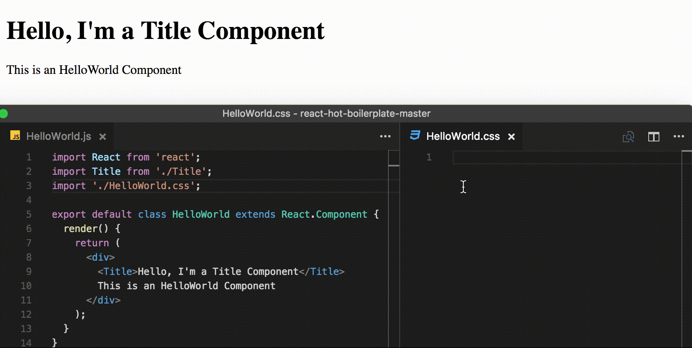

# react-cssom

[](https://travis-ci.org/mbasso/react-cssom)
[](https://www.npmjs.com/package/react-cssom)
[](https://www.npmjs.com/package/react-cssom)
[](https://coveralls.io/github/mbasso/react-cssom?branch=master)
[](https://gitter.im/mbasso/react-cssom?utm_source=badge&utm_medium=badge&utm_campaign=pr-badge&utm_content=badge)

> Css selector for React Components



## Motivation

Styling components is a critical point when we decide to develop in React.
There are a lot of ways in which we can do this but all of these have pros and cons.
In some situations this means having a strong connection with the source code, that is not so good.
With ReactCSSOM we have tried to develop a system that allows us to separate `js` and `css`.

Using ReactCSSOM means:

- Scoped styles based on component's structure
- Each Component has its own `style.css`
- No extra inline styles, use them only when and where you really need, this means better performance
- No limitations to CSS power
- Easy to use with CSS Preprocessors (no more stuff needed)
- Highly expressive
- Lightweight, only 88 lines of js

## Installation

You can install react-cssom using [npm](https://www.npmjs.com/package/react-cssom):

```bash
npm install --save react-cssom
```

If you aren't using npm in your project, you can include ReactCSSOM using UMD build in the dist folder with `<script>` tag.

## Usage

### Basic

Once you have installed react-cssom, supposing a CommonJS environment, you can import it in your index file, before `ReactDOM.render` and `App` import.

```js
import React from 'react';
import ReactDOM from 'react-dom';
import ReactCSSOM from 'react-cssom';
import App from './App';

ReactDOM.render(<App />, document.getElementById('root'));
```

Now you can use react-cssom as you can see in the gif above, just like normal css, but with a special selector for React Components.
You can load styles in the way that you prefer but is important to keep in mind that selectors must be in this form:

```css
.⚛ComponentName
```

For example, this is a valid one `.⚛App`.
So, **pay attention that components' names and css selectors always match.
This is particular important if you have css-modules that modifies the original names, or code obfuscation.**

The first ones for example need a syntax like this:

```css
:global .⚛ComponentName {
	/* styles here */
}
```

And the second one, considering for example a minification process with webpack's UglifyJsPlugin (see [here](https://github.com/facebook/react/issues/4915) for more information),
need a component with a displayName attribute like this:

```js
class ComponentName extends React.Component {

	static propTypes = {
		// propTypes...
	}

	// this
	static displayName = 'ComponentName';

	render() {
		// render here...
	}
}

// or this
// ComponentName.displayName = 'ComponentName';
```

Please, note also that if you are using a functional stateless component, you have to wrap it with our function to make it work.
This function accepts the component as parameter of the first function and its name as parameter of its return:

```js
import ReactCSSOM from 'react-cssom';

const Foo = ReactCSSOM.inject((props) => (
	<div>
		Hello {props.name}
	</div>
))('Foo');
```


### Adapting based on props

If you want to set styles based on props, you can do it in 3 ways:

- Using a style tag directly into the component:
```js
export default class Button extends React.Component {

	static displayName = 'Button';

	render() {
		return (
			<div>
				<style>
					{`
						.⚛Button > button {
							background-color: ${this.props.primary ? 'blue' : 'black'}
						}
					`}
				</style>
				<button>
					Click me
				</button>
			</div>
		)
	}
}
```


- Setting a specific class, maybe using css-modules, as we can see here:
```js
import styles from './Button.css';

export default class Button extends React.Component {

	static displayName = 'Button';

	render() {
		return (
			<button
				className={this.props.primary ? styles.primary : styles.default}
			>
				Click me
			</button>
		)
	}
}
```

and here is the corresponding css, note the global selector:

```css
:global .⚛Button {
	height: 50px;
	width: 100px;
}

.primary {
	background-color: blue;
}

.primary:global.⚛Button {
	color: yellow;
}

.default {
	background-color: grey;
}

.default:global.⚛Button {
	color: black;
}
```

- Setting inline styles, as we can see in this example:
```js
class Button extends React.Component {

	static displayName = 'Button';

	render() {
		return (
			<button
				style={{
					backgroundColor: this.props.primary ? 'blue' : 'black',
				}}
			>
				Click me
			</button>
		)
	}
}
```

## Change Log

This project adheres to [Semantic Versioning](http://semver.org/).  
Every release, along with the migration instructions, is documented on the Github [Releases](https://github.com/mbasso/react-cssom/releases) page.

## Authors
**Matteo Basso**
- [github/mbasso](https://github.com/mbasso)
- [@teo_basso](https://twitter.com/Teo_Basso)

## Copyright and License
Copyright (c) 2016, Matteo Basso.

react-cssom source code is licensed under the [MIT License](https://github.com/mbasso/react-cssom/blob/master/LICENSE.md).
